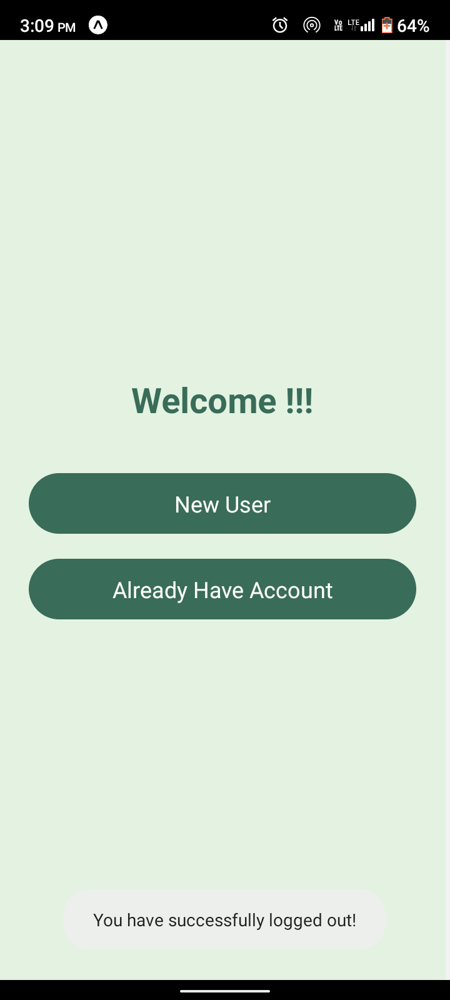
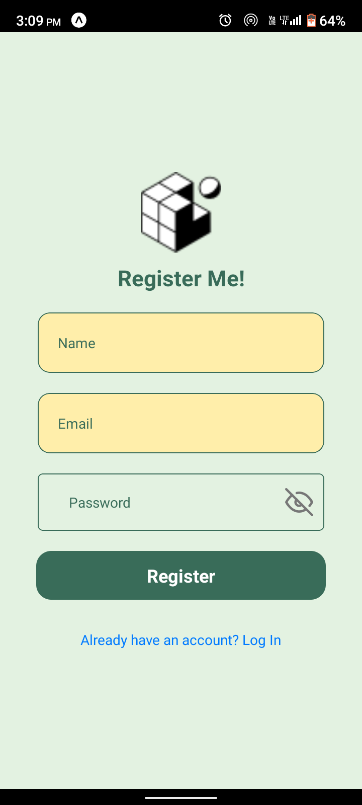
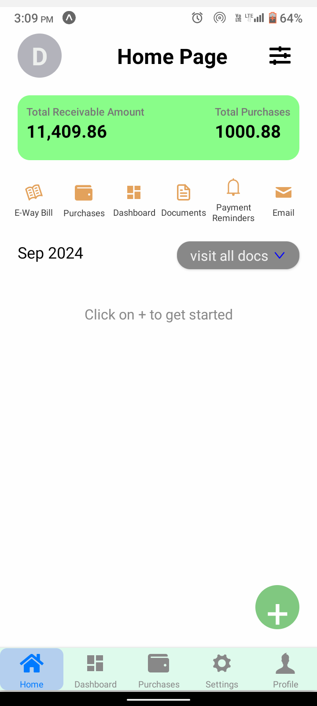
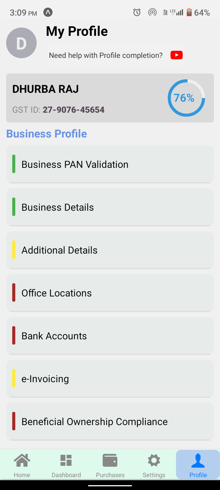

# BillMe

**BillMe** is a React Native application designed to simplify bill management. The app includes user authentication, including Google Sign-In, and provides users with easy access to track their bill payments with progress indicators.

## Table of Contents

- [Features](#features)
- [Screens](#screens)
- [Screenshots](#screenshots)
- [Technologies Used](#technologies-used)
- [Installation](#installation)
- [Running the Project](#running-the-project)
- [Project Structure](#project-structure)
- [License](#license)

## Features

- **Authentication**: Sign up, login, logout, and password reset functionality using email and Google authentication.
- **Bill Tracking**: Track bills with statuses—`Not Completed`, `In Progress`, and `Completed`.
- **Navigation**: Combined stack and tab navigation for a smooth user experience, along with a Business Stack for managing specific business-related screens.
- **UI Enhancements**: Customized stack headers and color-coded progress states for easy tracking.
- **Page Models**: Structured models to manage data on different pages.

## Screens

1. **Welcome Screen**: Entry point with options to register or login.
2. **Registration Screen**: User registration with Google sign-in.
3. **Login Screen**: Email and Google-based authentication.
4. **Home Screen**: Displays bills with different status indicators.
5. **Profile Screen**: View profile details and logout option.
6. **Business Screens**: Special screens dedicated to business-related features.

## Screenshots

1. Welcome Screen 
2. Registration Screen 
3. Login Screen 
4. Home Screen 
5. Profile Screen 


## Technologies Used

- **React Native**: Mobile framework for building native apps.
- **React Navigation**: Stack and tab navigation for a seamless app flow.
- **Firebase**: For authentication and database (requires setup).
- **Google Sign-In**: Easy Google authentication via Firebase.
- **Expo**: Toolchain for developing, building, and deploying React Native apps.

## Installation

Follow these steps to set up and run the project locally.

### Prerequisites

- [Node.js](https://nodejs.org/) installed.
- [Expo CLI](https://docs.expo.dev/get-started/installation/) installed.
- Yarn (recommended).

### Setup

1. Clone the repository:

   ```bash
   git clone https://github.com/dee-raj/Bill-Me.git
   cd Bill-Me
   ```

2. Install dependencies:

   ```bash
   yarn install
   ```

3. Configure Firebase:
   - Set up a Firebase project and add Firebase credentials.
   - Follow Firebase and Google Sign-In documentation for platform-specific configuration.

4. Create a `.env` file for Firebase and Google Sign-In credentials.

### Running the Project

To start the development server:

```bash
npx expo start
```

This will open an Expo DevTools page in your browser, where you can run the project on an emulator or a real device.


## License

This project is licensed under the MIT License. See the [LICENSE](LICENSE) file for details.
